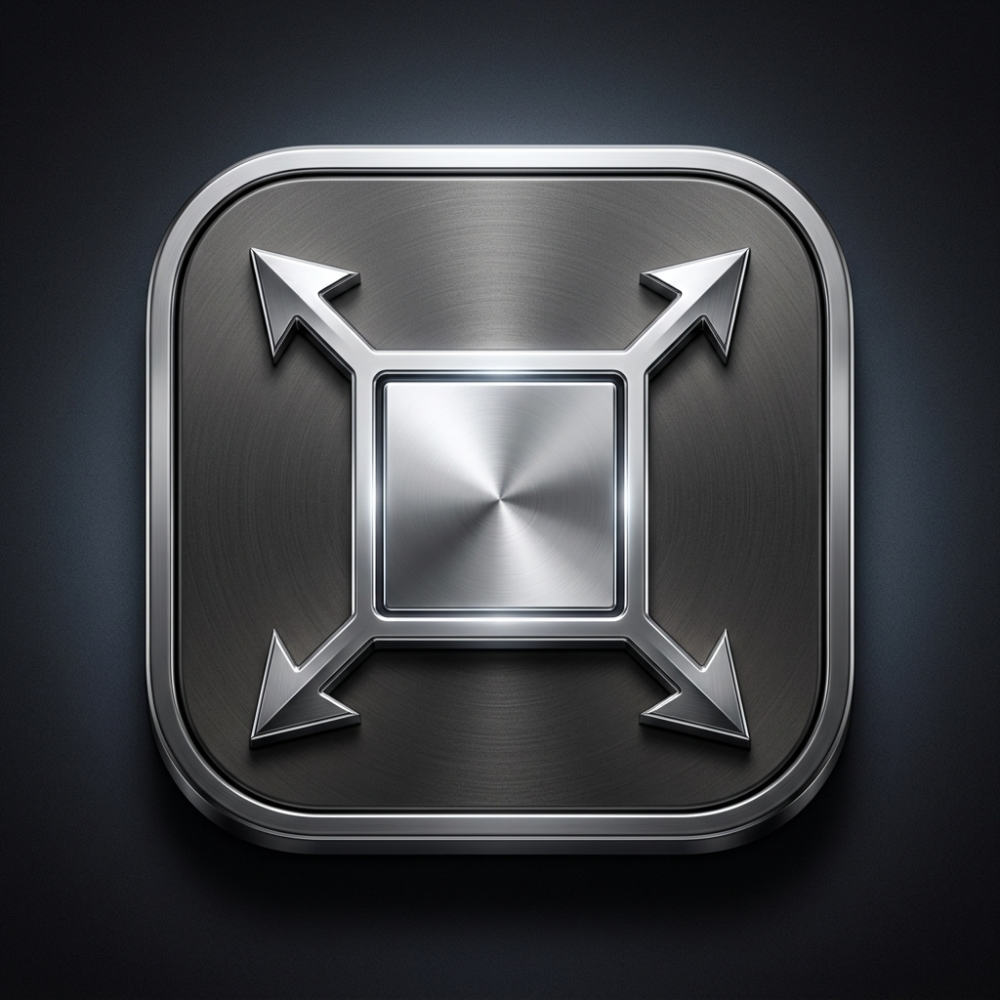
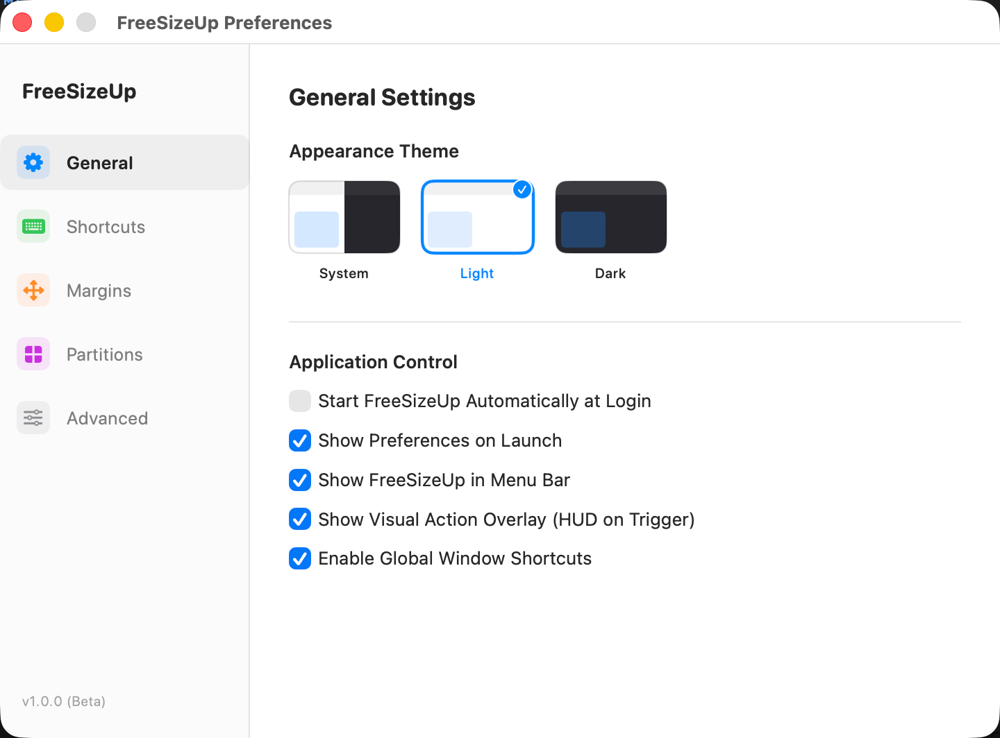
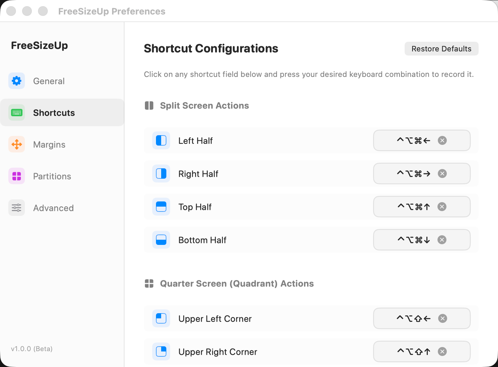
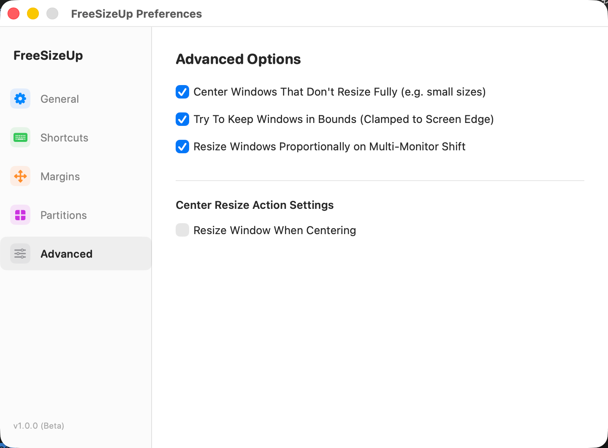
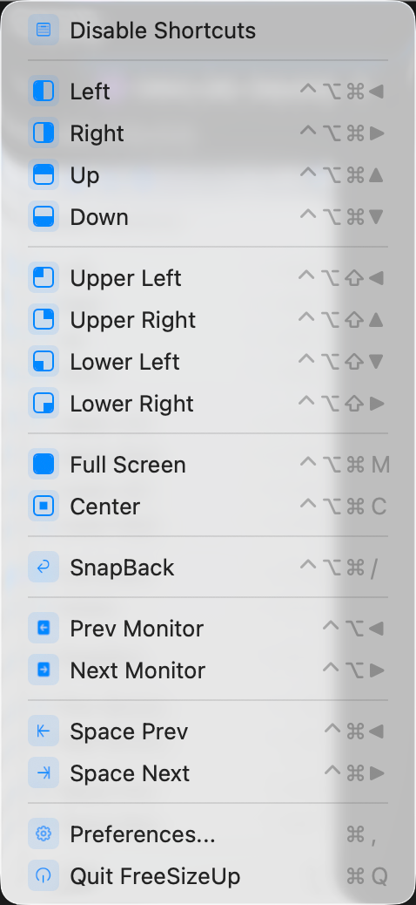

<p align="center">
  
</p>

# 🖥️ FreeSizeUp

> **FreeSizeUp** is a premium, ultra-lightweight, and fully native window manager for macOS — built as the ultimate **open-source alternative to SizeUp (SizeUp 的开源替代版本)**. It replicates 100% of classic SizeUp keyboard shortcuts and layout operations while introducing a modernized visual system featuring a matching four-corner-arrows visual identity, interactive custom partition sliders, screen edge margins, and complete Swift 6 strict concurrency safety.

Designed with native performance and premium Apple design aesthetics in mind, FreeSizeUp allows you to split, resize, and position windows instantly across multiple displays and virtual spaces using lightweight global hotkeys.

---

## 🎨 Visual Preview

Here is a preview of the modernized user interface, layout configurations, and the dynamic system tray dropdown menu:

| ⚙️ General Settings & Theme | 🎛️ Unified Shortcuts Configuration |
| :---: | :---: |
|  |  |

| 🛠️ Advanced Settings | 📲 Native Menu Bar Dropdown |
| :---: | :---: |
|  |  |

---

## ✨ Key Features

*   **⚡ Splits & Halves**: Instantly split windows into Left, Right, Top, or Bottom halves.
*   **📐 Quadrants & Corners**: Move windows into Top-Left, Top-Right, Bottom-Left, or Bottom-Right corner quadrants.
*   **🖥️ Multi-Display Support**: Shift windows across multiple displays with support for absolute margins or proportional scaling.
*   **🌌 Virtual Spaces Workaround**: Seamlessly push windows across macOS Virtual Spaces (Space Prev / Space Next) using Titlebar-grab simulations.
*   **⏪ SnapBack (Undo)**: Revert the last window resizing action immediately to restore its previous size and position.
*   **📊 Custom Ratios & Margins**:
    *   **Interactive Margins**: Pixels offsets around screen borders to prevent overlaps with menu bars, docks, or widgets.
    *   **Interactive Partition Sliders**: Adjust Left/Right and Top/Bottom split percentages with real-time visual previews.
*   **🌟 Glassmorphic HUD Overlay**: Displays a beautiful glowing translucent overlay showing a schematic of the triggered action.
*   **🎙️ Smart Hotkey Recorder**: Record keyboard hotkeys dynamically, complete with a clean SwiftUI focus-cancelling interface.
*   **🌓 Adaptive Appearance**: Fully supports native Light Mode, Dark Mode, and Follow System themes.
*   **🛡️ Swift 6 Ready**: Zero external dependencies, fully compliant with Swift 6 strict concurrency checks.

---

## ⌨️ Default Keyboard Shortcuts

| Category | Action | Shortcut |
| :--- | :--- | :--- |
| **Splits (Halves)** | Left Half | `⌃ ⌥ ⌘ ←` (Ctrl + Opt + Cmd + Left) |
| | Right Half | `⌃ ⌥ ⌘ →` (Ctrl + Opt + Cmd + Right) |
| | Top Half | `⌃ ⌥ ⌘ ↑` (Ctrl + Opt + Cmd + Up) |
| | Bottom Half | `⌃ ⌥ ⌘ ↓` (Ctrl + Opt + Cmd + Down) |
| **Quadrants (Corners)** | Upper Left Corner | `⌃ ⌥ ⇧ ←` (Ctrl + Opt + Shift + Left) |
| | Upper Right Corner | `⌃ ⌥ ⇧ ↑` (Ctrl + Opt + Shift + Up) |
| | Lower Left Corner | `⌃ ⌥ ⇧ ↓` (Ctrl + Opt + Shift + Down) |
| | Lower Right Corner | `⌃ ⌥ ⇧ →` (Ctrl + Opt + Shift + Right) |
| **Displays & Spaces** | Previous Monitor | `⌃ ⌥ ⌘ ,` (Ctrl + Opt + Cmd + Comma) |
| | Next Monitor | `⌃ ⌥ ⌘ .` (Ctrl + Opt + Cmd + Period) |
| | Previous Virtual Space | `⌃ ⌥ ⌘ [` (Ctrl + Opt + Cmd + Left Bracket) |
| | Next Virtual Space | `⌃ ⌥ ⌘ ]` (Ctrl + Opt + Cmd + Right Bracket) |
| **System Resizing** | Full Screen | `⌃ ⌥ ⌘ M` (Ctrl + Opt + Cmd + M) |
| | Center Window | `⌃ ⌥ ⌘ C` (Ctrl + Opt + Cmd + C) |
| | SnapBack (Undo Layout) | `⌃ ⌥ ⌘ /` (Ctrl + Opt + Cmd + Slash) |

---

## ⚙️ Installation & Building

### Prerequisites
*   macOS 13.0 or later (Ventura / Sonoma / Sequoia)
*   Xcode 14.0+ or Command Line Tools (with Swift compiler installed)

### 🔨 Build Instructions
1.  Clone or download this repository:
    ```bash
    git clone https://github.com/yourusername/free-sizeup.git
    cd free-sizeup
    ```
2.  Compile and package the standalone `.app` bundle:
    ```bash
    chmod +x build.sh
    ./build.sh
    ```
3.  Launch the application:
    ```bash
    open FreeSizeUp.app
    ```

---

## 🔒 Granting Accessibility Permissions

Since macOS protects window controls under Security Preferences, FreeSizeUp requires **Accessibility permissions** to interact with and resize windows of other apps.

1.  On first launch, you will see a prompt to grant permission.
2.  Open ** -> System Settings -> Privacy & Security -> Accessibility**.
3.  Add or toggle **FreeSizeUp** to **ON**.
4.  FreeSizeUp will immediately start working in your Menu Bar!

---

## 🛠️ Architecture Stack

*   **UI Framework**: SwiftUI (Preferences Views & Shortcut Recorder)
*   **Event Handling**: Carbon Core Framework (`RegisterEventHotKey` for global system-wide key bindings)
*   **Window Engine**: ApplicationServices (`AXUIElement` Accessibility API for high-precision layouts)
*   **Isolation & Thread Safety**: Isolated `@MainActor` environments conforming to Swift 6 Concurrency constraints.

---

## ⚖️ Legal Disclaimer / 免责声明

**FreeSizeUp** is an independent, clean-room open-source project. 

* **No Affiliation**: This project is **not** affiliated, associated, authorized, endorsed by, or in any way officially connected with **Irradiated Software** or any of its subsidiaries or affiliates. The official SizeUp website can be found at [irradiatedsoftware.com/sizeup](https://www.irradiatedsoftware.com/sizeup/).
* **Trademarks**: "SizeUp" is a registered trademark of Irradiated Software. All other trademarks, service marks, and company names are the property of their respective owners. Their use in this project does not imply any affiliation with or endorsement by them.
* **No Warranty**: The software is provided "as is", without warranty of any kind, express or implied. Under no circumstances shall the authors or copyright holders be liable for any claims, damages, or other liabilities.

**FreeSizeUp** 是一个完全独立开发、从双零起步编写代码的纯原生开源项目。
* **无官方关联**：本开源项目与 **Irradiated Software** 官方无任何隶属、联合、授权、代言或官方关联。经典版 SizeUp 属于其原公司/作者所有。
* **商标声明**："SizeUp" 是 Irradiated Software 的注册商标。本仓库中对该商标的所有提及仅作为表明本应用的功能特征及“开源替代”定位之客观性技术参考，绝不构成任何商标侵权意图或官方关联暗示。
* **免责保证**：本软件按“原样”提供，不提供任何明示或暗示的保证（包括但不限于对特定用途的适用性和非侵权性的保证）。在任何情况下，作者或版权所有者均不对因本软件的使用而产生的任何索赔、损害或其他责任负责。

---

## 📄 License

This project is open-source and available under the [MIT License](LICENSE).
